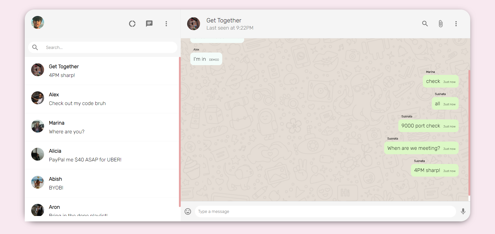

# WhatsApp-Web Clone 🤙

## A WhatsApp-Web Clone made with the MERN Stack
---
## Tech used:

### *Stack*:

 **M** - MongoDb
 
 **E** - Express
   
**R**- React
     
**N**- Node
     

### *Real-time updation*:

 **Pusher**

---
## Additional tasks to complete:
- [ ] Make Firebase Authorization 
- [ ] Separate rooms for separate chats
- [ ] Deploy
